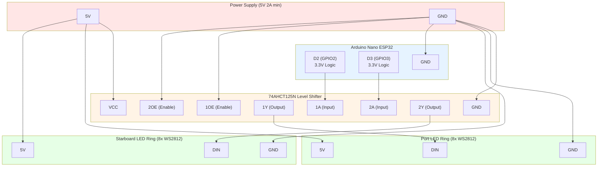
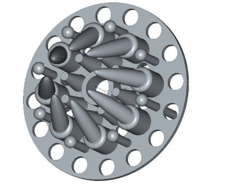
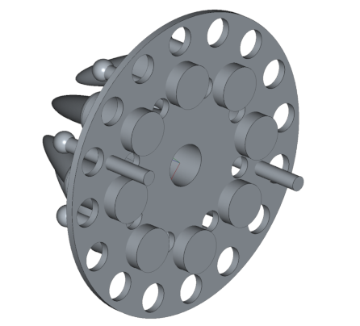

Created: 2025 January 13

# Bussard Rotation Effect

## Table of Contents

- [Overview](<#overview>)
- [Hardware Configuration](<#hardware configuration>)
- [Animation Algorithm](<#animation algorithm>)
- [Configuration Parameters](<#configuration parameters>)
- [Implementation Notes](<#implementation notes>)
- [Version History](<#version history>)

[Return to Table of Contents](<#table of contents>)

## Overview

Counter-rotating color wave animation for Star Trek TOS Bussard collectors using two 8-LED WS2812 rings. Implements continuous rotation with probability-based flash overlays to simulate the organic lighting characteristics observed in original series footage.

**Key Features:**
- Independent counter-rotating rings (port CCW, starboard CW)
- Rotating red+green base color wave
- Random red+blue and pure green flash overlays
- ~50 RPM rotation speed
- Independent LED fade cycles

[Return to Table of Contents](<#table of contents>)

## Hardware Configuration

**Board:** Arduino Nano ESP32

**LED Hardware:**
- 2x AZDelivery RGB LED Ring 8 Bit WS2812 5050
- Port ring: Pin D2
- Starboard ring: Pin D3
- Color order: GRB
- Protocol: WS2812 (800kHz)

**Power Requirements:**
- 8 LEDs × 60mA max × 2 rings = 960mA maximum
- Typical operation: ~400-600mA (due to color mixing)

### Wiring Diagram



**Critical Wiring Notes:**
- ESP32 outputs 3.3V logic; WS2812B requires >3.5V for reliable HIGH at 5V power
- 74AHCT125N provides 3.3V to 5V level translation
- Enable pins (1OE, 2OE) tied to GND for always-enabled operation
- External 5V supply required (2A minimum); USB power insufficient
- Common ground essential between all components

### 74AHCT125N Pinout

```mermaid
graph TB
    subgraph IC["74AHCT125N - Quad Level Shifter (14-pin DIP)"]
        direction LR
        subgraph Left["Left Side"]
            P1["1: 1OE (Enable)"]:::enable
            P2["2: 1A (Input)"]:::input
            P3["3: 1Y (Output)"]:::output
            P4["4: 2OE (Enable)"]:::enable
            P5["5: 2A (Input)"]:::input
            P6["6: 2Y (Output)"]:::output
            P7["7: GND"]:::power
        end
        subgraph Right["Right Side"]
            P14["14: VCC (5V)"]:::power
            P13["13: 4OE (Enable)"]:::unused
            P12["12: 4A (Input)"]:::unused
            P11["11: 4Y (Output)"]:::unused
            P10["10: 3OE (Enable)"]:::unused
            P9["9: 3A (Input)"]:::unused
            P8["8: 3Y (Output)"]:::unused
        end
    end

    subgraph Connections["Connections"]
        ESP32_D2["ESP32 D2<br/>(3.3V)"]
        ESP32_D3["ESP32 D3<br/>(3.3V)"]
        PORT_LED["Port Ring DIN<br/>(5V logic)"]
        STBD_LED["Starboard Ring DIN<br/>(5V logic)"]
        VCC_5V["5V Supply"]
        GND_COM["Common GND"]
    end

    ESP32_D2 --> P2
    P3 --> PORT_LED
    ESP32_D3 --> P5
    P6 --> STBD_LED
    VCC_5V --> P14
    GND_COM --> P7
    GND_COM --> P1
    GND_COM --> P4

    classDef power fill:#ffe6e6,stroke:#cc0000,stroke-width:2px
    classDef input fill:#e6f3ff,stroke:#0066cc,stroke-width:2px
    classDef output fill:#e6ffe6,stroke:#00cc00,stroke-width:2px
    classDef enable fill:#fff4e6,stroke:#ff9900,stroke-width:2px
    classDef unused fill:#f0f0f0,stroke:#999999,stroke-width:1px,stroke-dasharray: 5 5
```



**Pinout Notes:**
- Channels 1 and 2 (pins 1-6) used for port and starboard rings
- Channels 3 and 4 (pins 8-13) unused in this application
- Enable pins active LOW: tie to GND for always-enabled operation
- Each channel translates one 3.3V input to one 5V output
- Pin 7 (GND) and Pin 14 (VCC) must connect to stable power rails

**Physical Installation:**





Bussard collector light filter assembly showing LED ring configuration.

[Return to Table of Contents](<#table of contents>)

## Animation Algorithm

### Base Layer: Rotating Color Wave

Each LED maintains independent state (red, green, blue, fade_direction). Color states rotate through ring each frame:
- Port: Counter-clockwise rotation
- Starboard: Clockwise rotation
- Base color: Red (255) + Green fade (0-63)
- Rotation delay: 24ms per step (~50 RPM)

### Flash Layer: Probability-Based Overlays

Each LED independently checks for flash trigger each frame:
- 12% total flash probability per LED per frame
- Flash types:
  - Red+Blue: 16% of flashes (255, 0, 0-127)
  - Pure Green: 4% of flashes (0, 0-127, 2)
- Flash overrides base color during fade-up/fade-down cycle
- Returns to rotation pattern after flash completes

### Update Sequence

1. Check rotation timing (24ms intervals)
2. Rotate color states through rings
3. Update base color fade cycles
4. Check flash triggers (random probability)
5. Update active flash animations
6. Apply composite colors to FastLED
7. Display output

[Return to Table of Contents](<#table of contents>)

## Configuration Parameters

### Timing Parameters

```cpp
#define ROTATION_DELAY  150   // Rotation step delay in milliseconds
#define FLASH_PROB      12    // Flash probability per LED per frame (%)
```

**Rotation Speed Calculation:**
- 50 RPM = 50 rotations/minute = 60000ms / 50 = 1200ms per rotation
- 8 LEDs per rotation = 1200ms / 8 = 150ms per LED step
- Current setting: 150ms = 50 RPM
- Adjust ROTATION_DELAY to achieve desired visual effect

### Color Probabilities

```cpp
#define PROB_RED_BLUE   16    // Percentage of flashes that are red+blue
#define PROB_PURE_GREEN 4     // Percentage of flashes that are pure green
```

### Hardware Parameters

```cpp
#define PIN_PORT        2     // Port ring data pin
#define PIN_STARBOARD   3     // Starboard ring data pin
#define LED_COUNT       8     // LEDs per ring
#define BRIGHTNESS      255   // Global brightness (0-255)
```

[Return to Table of Contents](<#table of contents>)

## Implementation Notes

### Thread Safety

All state updates occur within single-threaded `loop()` function. No interrupt conflicts with FastLED output.

### Memory Usage

- 2 rings × 8 LEDs × 3 bytes (CRGB) = 48 bytes for LED output
- 2 rings × 8 LEDs × sizeof(LEDState) = ~112 bytes for state tracking
- Total: ~160 bytes SRAM for LED management

### Performance

- Frame rate: Limited by rotation delay (24ms) + processing time
- Processing overhead: <1ms per frame for 16 LEDs
- Effective frame rate: ~41 FPS

### Debugging

Serial output provides initialization confirmation. Monitor at 115200 baud.

### Migration from Original Code

**Changes from Bussards.ino:**
- Reduced from 10 to 8 LEDs per ring
- Adafruit_NeoPixel → FastLED library
- Added rotation algorithm
- Unified flash probability system
- Counter-rotation support
- Removed redundant code duplication

[Return to Table of Contents](<#table of contents>)

## Version History

| Version | Date | Description |
|---------|------|-------------|
| 1.0.3   | 2025-01-18 | Added 74AHCT125N pinout diagram |
| 1.0.2   | 2025-01-18 | Corrected ROTATION_DELAY to 150ms for accurate 50 RPM |
| 1.0.1   | 2025-01-18 | Added Mermaid wiring diagram with 74AHCT125N level shifter |
| 1.0.0   | 2025-01-13 | Initial implementation with counter-rotation and FastLED |

[Return to Table of Contents](<#table of contents>)

---

Copyright (c) 2025 William Watson. This work is licensed under the MIT License.
