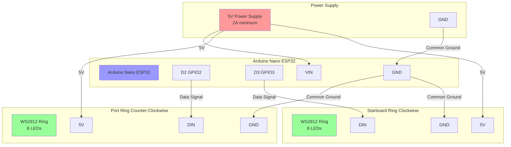

Created: 2025 January 13

# Bussard Rotation Wiring Diagram

## Table of Contents

- [Circuit Overview](<#circuit overview>)
- [Wiring Diagram](<#wiring diagram>)
- [Pin Assignments](<#pin assignments>)
- [Power Considerations](<#power considerations>)
- [Assembly Notes](<#assembly notes>)
- [Version History](<#version history>)

[Return to Table of Contents](<#table of contents>)

## Circuit Overview

Dual WS2812 ring configuration for counter-rotating Bussard collector animation. External 5V power supply required due to combined LED current draw exceeding USB specification limits.

[Return to Table of Contents](<#table of contents>)

## Wiring Diagram

[Return to Table of Contents](<#table of contents>)

## Pin Assignments

### Arduino Nano ESP32

| Pin | Function | Connection |
|-----|----------|------------|
| D2 (GPIO2) | Port ring data | WS2812 ring DIN |
| D3 (GPIO3) | Starboard ring data | WS2812 ring DIN |
| VIN | Power input | 5V supply (+) |
| GND | Ground | Common ground bus |

### WS2812 Rings (Both)

| Pin | Function | Connection |
|-----|----------|------------|
| DIN | Data input | Arduino D2 or D3 |
| 5V | Power input | 5V supply (+) |
| GND | Ground | Common ground bus |

[Return to Table of Contents](<#table of contents>)

## Power Considerations

### Current Requirements

**Per Ring:**
- 8 LEDs × 60mA maximum = 480mA per ring
- Typical operation: 200-300mA (mixed colors, not full white)

**Total System:**
- Maximum: 960mA (both rings full brightness white)
- Typical: 400-600mA (red/green animation)
- Arduino: ~50-100mA
- **Total required: 2A minimum power supply**

### Power Supply Specifications

**Required:**
- Voltage: 5V DC regulated
- Current: 2A minimum (3A recommended for headroom)
- Connector: Match Arduino VIN/GND or use screw terminals

**USB Power:**
- ❌ Insufficient for this circuit
- USB 2.0: 500mA maximum
- USB 3.0: 900mA maximum
- Circuit requires 1A+ during operation

### Protection

**Recommended (not mandatory):**
- 1000µF capacitor across power supply output (reduces voltage spikes)
- 470Ω resistor in series with each data line (protects first LED)

[Return to Table of Contents](<#table of contents>)

## Assembly Notes

### Wiring Sequence

1. **Establish common ground**
   - Connect power supply GND to Arduino GND
   - Connect both ring GND pins to Arduino GND
   - All ground connections must be common

2. **Connect power**
   - 5V supply (+) → Arduino VIN
   - 5V supply (+) → Port ring 5V
   - 5V supply (+) → Starboard ring 5V

3. **Connect data signals**
   - Arduino D2 → Port ring DIN
   - Arduino D3 → Starboard ring DIN

### Wire Gauge Recommendations

- Power (5V, GND): 22 AWG minimum (18 AWG preferred for longer runs)
- Data signals: 24-28 AWG acceptable

### Testing Procedure

1. **Visual inspection**: Verify all connections before applying power
2. **Power test**: Measure 5V at ring power pins with multimeter
3. **Upload code**: Flash bussards_rotation.ino to Arduino
4. **Functional test**: Observe counter-rotating animation
5. **Monitor serial**: Check initialization messages at 115200 baud

### Troubleshooting

| Symptom | Probable Cause | Solution |
|---------|---------------|----------|
| No LEDs illuminate | Power not connected | Verify 5V at ring power pins |
| Erratic colors/flashing | Floating data line | Check data pin connections |
| First LED wrong color | Color order mismatch | Verify GRB setting in code |
| Dim output | Insufficient current | Upgrade to higher amperage supply |
| Arduino resets | Voltage drop | Improve power supply regulation |

[Return to Table of Contents](<#table of contents>)

## Version History

| Version | Date | Description |
|---------|------|-------------|
| 1.0.0   | 2025-01-13 | Initial wiring diagram for dual WS2812 rings |

[Return to Table of Contents](<#table of contents>)

---

Copyright (c) 2025 William Watson. This work is licensed under the MIT License.
